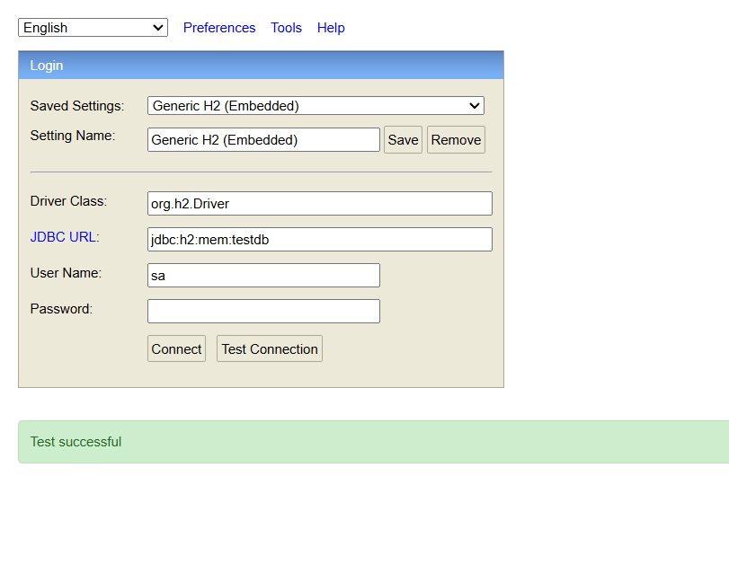
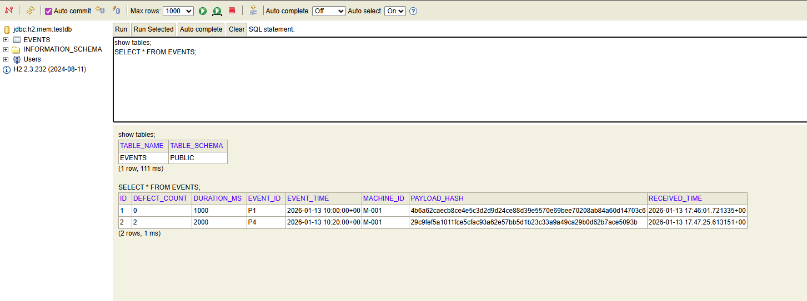

# 🏭 Machine Events Backend System

This project is a **Spring Boot backend application** built as part of a **Backend Intern Assignment**.  
It simulates a backend system that ingests machine events, handles validation and deduplication, and provides statistics APIs.

---

## 🛠 Tech Stack

- **Java** (17+)
- **Spring Boot**
- **Spring Data JPA**
- **H2 In-Memory Database**
- **Maven**
- **JUnit 5**

---

## 📌 Features

### 1. Event Ingestion (Batch)
- Ingests a batch of machine events
- Validates event data
- Deduplicates events using `eventId`
- Updates events if payload changes
- Rejects invalid events

### 2. Validation Rules
- `durationMs` must be between `0` and `6 hours`
- `eventTime` cannot be more than `15 minutes` in the future
- `defectCount = -1` means unknown (ignored in defect stats)

### 3. Statistics API
- Total events in a time window
- Total defects (excluding unknown defects)
- Average defect rate (defects/hour)
- Health status (`Healthy` / `Warning`)

---

---

## ▶️ How to Run the Project

```bash
.\mvnw.cmd spring-boot:run
```
---
### Screenshot of Result




